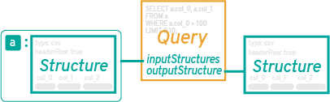
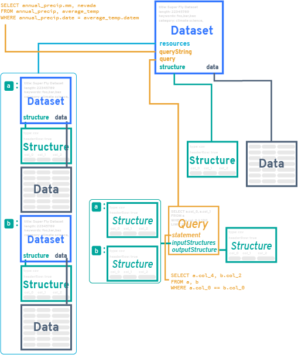
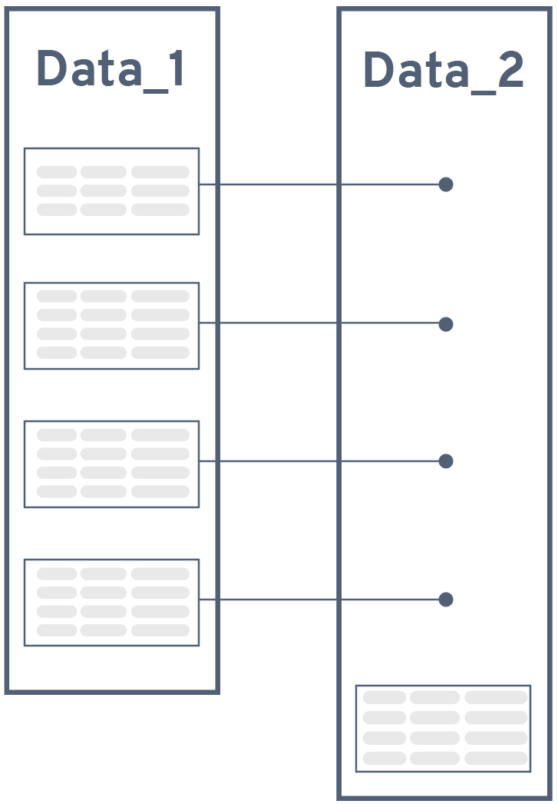

<h1 align="center">Deterministic Querying for the Distributed Web</h1>

<p align="center">
<a href="http://www.brendan.nyc">Brendan O'Brien</a><br>
<a href="http://www.cds.caltech.edu/~mhucka/">Michael Hucka</a>
</p>
<p align="center">
August 2017<br>
*DRAFT*
</p>
<p align="center">
<b>Abstract</b>
</p>

The current infrastructure that underlies the distribution and processing of data over the Internet has enabled dramatic advances in a wide variety of human activities.  Recent trends promoting open data promise even greater benefits as the number and variety of networked data sets grows.  However, while current technologies and architectures obviously do work, they also show signs of systemic inefficiencies that impede effective large-scale discovery, distribution, preservation and reuse of data sets.  An important source of inefficiencies is rooted in the database-centered pipeline that underlies much of data processing on the Internet today.  The ongoing transition to a content-addressed permanent web offers an opportunity to replace certain software architecture patterns with alternatives that are more efficient and scale more effectively.  We introduce one such new pattern, _deterministic querying_, that combines formalized query definitions, formalized data descriptions, linked metadata, hashing, and a content-addressed file system.  The result supports database-free reuse of data and data processing results---and can do so on the scale of the global Internet.


# Introduction

Open data is a boon to research and progress [@murray2008open; @piwowar2013data; @lowndes2017our; @gewin2016data; @miguel2014promoting].  Though exact numbers are unavailable for the amount of data stored around the world, it is clear it must already be stupendous.  Measured in terms of web pages, the best estimate in mid-2017 puts the number of visible web pages at nearly 50&nbsp;billion [@vandenbosch2016estimating], while in terms of data transmitted over the Internet, global IP traffic reached 1.2&nbsp;zettabytes in 2016 and is predicted to reach 3.3 zettabytes per year by 2021 [@cisco2017zettabyte].  The continuing growth of data being made available on the Internet promises a windfall of benefits in many areas, enabling new discoveries, powering new innovations, lowering costs, and increasing transparency [@martin2017opening; @mckiernan2016open; @madan2017advances; @ferguson2014big; @west2014open; @kansakar2016review].

The open data movement has in part been inspired by and driven by the open _source_ movement, and many of the principles espoused by open data advocates mirror those of open source efforts [@baack2015datafication].  At the heart of both movements is the goal to share the results of people's work.  However, open source has developed methods that are arguably more effective than comparable methods used in open data today.  In particular, developers have effective methods for _accumulating reusable work results in common pools_ so that they can be _directly_ shared, discovered, compared, and reused.  We argue that the comparable operations in open data today are cumbersome and inefficient due to the prevailing system architectures and design patterns in use.

## The open-source advantage

In open source, developers are encouraged to share their work, and to seek out existing solutions to problems [@crowston2008free; @bergquist2001power; @sojer2010code]. As a result, open source software builds upon other software, often by composing larger works out of smaller, reusable elements [@haefliger2008code].  This is possible because software elements---objects, functions, programs, modules---can be reused as static entities incorporated into other works.  The software elements represent intellectual labor: they are answers to questions.  Open-source developers solve new problems in part by seeking out answers to old questions and then using those answers to build their solutions.  This approach works well in software partly because developers have created precise mechanisms to describe the questions, the forms of the answers, and how to store and exchange them.  The questions and answers are defined by specific input and output conventions; storage, versioning, search and sharing is accomplished by revision control systems such as _git_; and composition is achieved by linking source code together into larger works.

In open data, the situation is more diverse and the steps are more inefficient.  The most coherent framework for data reuse is Linked Data [@heath2011linked; @auer2014linked].  This involves databases serving content on the Internet in RDF format [e.g., @maali2012publishing]; search and discovery is aided by some topical catalogs [e.g., @pesce2015setting].  Consumers can query and reference the content in the databases, often by creating pipelines to access, translate and process the data at the user end [e.g., @klimek2016linkedpipes].  However, Linked Data sources remain a minority today---most data sources are shared using the far simpler approach of exposing a network API that enables users to search and access content stored in databases.  The heterogeneity of the APIs and data formats in these cases complicates reuse of data and pushes complexity to individual users.

Whether using Linked Data or more conventional networked databases, it is important to note that different users often end up recreating the same solutions over and over.  The pattern is that some computing system is built to consume data sets, translate the data, perform operations on the data, and then interpret the results.  Sometimes the results are stored in a _local_ (not shared) database, usually in a different format than the source format; other times, the intermediate data produced by the operations is thrown away because the processed data is either assumed to be of no value to anyone else, or else the cost of storing, managing and sharing intermediate results is assumed to be higher than simply recomputing them on demand.

The consequence is that answers to questions are often not being shared, discovered or reused by other potential users of open data.

## Databases and modern software stacks

<!-- might work in citation to muir et al 2016 for how amount of data affects computation needs -->

Central to the problem of treating open data as reusable components is that there is no commonly-accepted method for using the _output_ of an open data process as the _input_ to another open data process when the processes are not part of a common pipeline.  Methods for reusing computational results in distributed workflows do exist, but they are specific to particular execution environments or frameworks [e.g., @elghandour2012restore].  No common scheme exists for persisting and reusing results of computations produced by widely-used software stacks such as those within today's web applications---the applications that power so many cloud-based services.

The architectural patterns underlying modern software stacks are part of the problem.  One of the greatest barriers to efficient reuse of results is the _positioning of the database_.  In many cases, the database is placed at the heart of a modern web-based application.  Data is stored in the database in a raw form, but then must be encoded into whatever form is consumed by the user at access time.  This approach of _interpreting the data outward_ towards the user makes perfect sense when the primary "view" or representation of this data is in the form of structured HTML:

```
  Database -> HTML Render -> Network -> Web Browser
```

From there, the natural next step is to provide programmatic access to this data via an HTTP API, which is essentially another "view" on the same central database:

```
  Database -> API Encode -> Network -> API Decode
```

This approach is flexible, and there is no question that it works---after all, it serves as the basis of many software systems.  However, this approach is the product of a long history of accumulated technical contexts, some of which are now the source of a great deal of inefficiency.  Consider what happens when the results of a data service are processed by another service:

```
  Database -> API Encode -> Network -> API Decode -> Process -> Database
```

In today's software environments, this pattern uses multiple servers to take data out of one database, serve it across a network, decode it, process it, and put it into another database (which in fact may require additional encoding, if the output of the processing does not match how it is stored in the database---and it often does not).  Further, since the amount of computing needed to process data grows with the amount of data [e.g., @muir2016real] and the amount of data generated by human activity grows continually, the amount of resources expended on this inefficient arrangement continues to increase.  To add insult to injury, every step requires separate engineering and long-term software maintenance.  This pattern heavily favors holding the data as closed information because  "opening" the data is an active effort that would require additional engineering time, CPU cycles, etc.

In other words, not only is this architecture inefficient in its use of network and computational resources: the economics of the arrangement actively discourages sharing outputs.

## Reimagining distributed open data

If it were possible to short-circuit some of the steps in the architectural pattern above, it could be made more efficient, at least for certain use cases.  For example, what if the decoding steps could be removed?  For that matter, what if the databases could be removed too, and the network itself somehow could be the database?  Then the process diagram would look like this:

```
  Network -> Process -> Network
```

The idea that the network itself could be "queried for data" as if it where a database may seem ludicrous at first.  The rest of this white paper describes how this _can_ be achieved, using a combination of technologies and architectural patterns.  Renewed attention to distributed, content-addressed networks with a robust linked-data structure provides the foundation necessary for achieving this.  What follows is a plan for a suite of tools that collectively provide the necessary components to be able to query a network, with the explicit design goal of facilitating the accumulation of results through data that is held on the network.

<!-- need compare this to "network is the database" -->

# Data, data structures, hashes, and queries

_Deterministic querying_ is designed for content-addressed network systems. In content-based addressing, data is stored and retrieved not by its location (as is done in the current Web via HTTP), but rather by a function computed over its content---specifically, a hash function that uniquely identifies the content [@aurora2007code].  This _content address_ can be computed independently by anyone for any content simply by running the hash function; they do not require a centralized authority to coordinate the assignment of labels or addresses.  This decentralized approach is the foundation of an emerging, modern, reliable data commons that deterministic querying aims to support.

Content-based addressing, also known as compare-by-hash [@aurora2007code], was first used for networked file systems in the early 2000's [@muthitacharoen2001low; @tolia2003opportunistic], and is a staple of peer-to-peer systems today.  In this work, we specifically target IPFS (the InterPlanetary File System), an open-source, distributed, content-addressed, peer-to-peer, versioned file system and protocol [@benet2014ipfs; @ipfs2017].  IPFS distributes content over a network using a secure distributed hash table [@maymounkov2002kademlia; @freedman2004democratizing; @baumgart2007s].  The basic premise of IPFS and other content-addressed file systems is that identical content will produce identical hash values, and thus be identified uniquely.

A fundamental goal of deterministic querying is to _maximize hash discovery_ in content-addressed networks.  The techniques below are aimed to ensure that equivalent data sets, as well as semantically-equivalent queries for data sets, each resolve to the same hash even if created by different parties in different locations at different times.  This consequently leads naturally to automatic discovery of existing data sets and queries, and deduplication of content on the network.

To maximize hash discovery, the process of describing data sets and queries must be made precise and consistent.  To the greatest extent possible, content and queries that are the same must produce the same hash value; thus, definitions of data resources and queries must follow carefully-defined conventions, and alternative forms must be limited.  We compensate for this rigidity by storing nonessential data separately, then connecting that to data sets and queries using separate mechanisms for linking and discovery.  This leads to the four building blocks of deterministic querying: `Data`, `Dataset`, `Structure`, and `Query`.

<p align="center">

</p>

## `Data` and `Structure`

<!--
This section could be called "schemas" or even "resources"; we avoid these terms because they are overused and may evoke unwanted associations.
-->

In the context of deterministic querying, `Data` has its natural meaning: a collection of raw values of _something_---numerical values, qualitative values, anything---organized in some systematic way.  An example file format for storing data today is the venerable comma-separated values (CSV) format, which consists of rows of numerical or text values separated by commas, with an optional first line containing column headings.  Here is an example:


```
lat,lng,precip,datestamp,title
60.00,-50.049303,349034,2017-02-14,precip measurement one
60.00,-50.049303,430004,2017-02-15,precip measurement two
...
```

A `Data` object in a content-addressed file system will be a static object identified by a hash value (henceforth, to be called simply its _hash_).  Assume that this data file resolves to the following base58-encoded [@vonGagern2017base58] hash on the network:

```
QmNk2XkDpn8vBantgpHt6B52kcyfHcQVJUF4QzDqjiGu52
```

As discussed above, this hash will be unique: any file whose computed hash matches the one above _will contain the same content_, no matter how or where it was created (assuming we use the same conventions for line endings, spaces and some other details), or where it's physically located in the content-addressed file system.  Queries to this data file will always run against the same set of bytes because the hash is _deterministic_.

Being able to interpret the bytes in a given `Data` object requires additional information outside of the `Data` itself.  This information is needed to provide precise details about how to interpret the content of a `Data` object.  That is the purpose of `Structure`.  It contains fields that indicate such things as the format of a `Data` object, the character encoding, compression settings, and other details.  Here is an example expressed in a human-readable JSON format:


```json
{
  "qri" : "1.0",
  "format" : "text/csv",
  "formatConfig" : {
    "delimiter": ",",
    "doubleQuote": true,
    "lineTerminator": "\r\n",
    "quoteChar": "\"",
    "skipInitialSpace": true,
    "header": true
  },
  "encoding" : "utf-8",
  "compression" : "gzip",
  "schema" : {
    "fields" : [
      { "title" : "col_0", "type" : "float", "default" : 0 },
      { "title" : "col_1", "type" : "float", "default" : 0 },
      { "title" : "col_2", "type" : "float", "default" : 0 },
      { "title" : "col_3", "type" : "datestamp", "default" : 0 },
      { "title" : "col_4", "type": "string", "default": "" }
    ]
  },
}
```

The detailed specification of `Structure` is given elsewhere, but as the example above illustrates, a `Structure` contains information that enables software and users to read the content of a `Data` object.  For example, `format` specifies how the data is stored; the field value is a MIME type value (e.g., `"text/csv"` for CSV [@shafranovich2005common]).  The related field `formatConfig` removes as much ambiguity as possible about how to interpret the specified `format` because some formats have a number of dialects, and variants need to be identified exactly.

The field `schema` merits some additional explanation.  Many formats such as CSV do not internally define the data types of values and provide no standard way of communicating this information, which forces the requirement to define an approach for externalizing it outside of a `Data` file.  It turns out, however, that describing the format explicitly in a generalized way also makes it possible to store and reuse those descriptions independently: they become another object in the content-addressed storage space, hashed and stored like everything else.

In fact, `Structure` is designed in such a way that it contains nothing about _meaning_.  If the values of a `Data` file change, the `Structure` can remain the same; if multiple `Data` objects anywhere on an IPFS network all have the same structure, the `Structure` object can remain the same.  This is true even if the `Data` objects are about entirely different things_.  As will become more clear below, this is part of the fundamental insight that makes deterministic querying possible.

<!--
Finally, it is worth noting that we focus on widely-used formats such as CSV as foundational storage formats for developing deterministic querying, but the extensions to other types of data should be clear.
-->

## `Dataset`

A `Structure` describes the form of a `Data` object.  The two are connected together, along with metadata about the `Data`, in a `Dataset` object.

<p align="center">

</p>

As illustrated above, a `Dataset` references one `Data` and one `Structure` object, and it also adds additional descriptive metadata.  A `Dataset` must resolve to one and only one `Data` entity; this is accomplished by using the unique hashes of the associated `Data` and `Structure` objects.  This separation of concerns achieves two important goals:

1. The same data can be described by different metadata.  For example, a repeated experiment may produce identical data, but it should be described differently if only to indicate different time stamps or conditions.  Separating the description from the values saves storage and bandwidth because only the changes (the metadata) are stored separately.

2. Metadata formats can be changed and updated independently.  In many cases, data remains static after it is gathered.  Software frameworks, however, often change rapidly, and developers and users find needs to change and update metadata about data.  With the separation described here, metadata can be changed without changing the underlying data objects.  This not only save resources: it makes clear in a concrete way that _it is the same data_.

To retain a trail of changes, `Dataset` contains a field called `previous` that references the hash of another `Dataset` object.  This establishes a clear history of changes to any component of a data set, whether this is the metadata, or the `Data`, or the `Structure`.  For example, when changes are made to metadata without changing the `Data` or its `Structure`, only the `Dataset` object needs to change:

<p align="center">

</p>

Conversely, if the `Data` changes but the `Structure` does not, the new `Dataset` object will reference the hash of a new `Data` object but point to the same `Structure`:

<p align="center">

</p>

Finally, if the `Structure` changes, the `Data` _may_ need to change as well, if the structural change affects how the data is read or written.  When the `Structure` change _does_ require a `Data` change, it is a schema migration.  A new `Dataset` object is created and it points to two new `Structure` and `Data` objects.  This indicates that the underlying data set has changed in such a way---either in structure or in values---that its hash signature is no longer the same.

<p align="center">

</p>

In each case above, the `Dataset` identifies the unique `Structure` object that defines the format of the data in the `Data` object(s), and the value of the `previous` has points to any previous `Dataset` definition that may have come before.

There are additional fields in `Dataset`; these are discussed further below.


## `Query`

In the abstract, information retrieval is the process of obtaining information from resources by posing questions [@sanderson2012history].  In contemporary computer terms, those "questions" are expressed in some formal language and acted upon by computer programs.  Information can be retrieved from many different kinds of resources; when the resources are databases, we speak of _database queries_.  We focus initially on the world's most widely-used database query language, SQL (Structured Query Language), which has a long history [@chamberlin2009sql], a syntax standardized by ISO [@iso2016sql], and is the basis of very many database-powered software systems in the world today.  As will become clear, the approach described here is not limited to SQL---any query language syntax that obeys similar principles and can be processed in similar ways can be used in deterministic queries.

Queries written in SQL make reference to columns in a tabular database, and express conditions that values must satisfy to be selected.  Here is an example:

```sql
SELECT a.datestamp, a.lat, a.lng, a.precip FROM a WHERE a.precip > 2.0
```

This query references a table in a database (`a`) and columns within that table (`a.datestamp`, `a.lat`, `a.lng`, `a.precip`), and stipulates a conditional expression (`a.precip > 2.0`) that certain column values must satisfy.  Note that this query knows nothing about the purpose of the database: all that matters is that the table has four columns and the expression `a.precip > 2.0` makes syntactic sense for the kinds of values in the table.  Although labels such as `lat`, `lng` and `precip` may have meaning to human readers, in reality the labels in SQL have absolutely no semantic meaning to the database itself.  This concept is nothing new---it is by design in SQL, so that database systems can be applied to many uses and types of data.

Now suppose we separate the table column references in such a way that the query is written in an abstract, data-agnostic way, and the binding of table columns in the query to table columns in an actual data set is maintained separately.  This _abstract query_ can be written by establishing some conventions, for example to use labels of the form `col_0`, `col_1`, `col_2`, etc., for the table columns.  An abstract query written in a standard form might look like this:

```sql
SELECT a.col_0, a.col_1, a.col_2, a.col_3 FROM a WHERE a.precip > 2.0
```

Now further suppose that we define the shape of `a` using a `Structure` object, described above.  This defines precisely the types of data values expected for each column in the query, as well as other properties of the data.  And naturally, we can do the same for the _result_ of the query: use another `Structure` object to describe the form of the data that the query will produce.

<p align="center">

</p>

This query is now independent of the semantics of the data: it operates on the form of the data and can be applied to any data that matches the description in the `Structure` of the input.  What's more, assuming that we define clear rules for writing these queries in a standard, consistent form, the same query will _always have the same hash value_ even if it is regenerated by different processes at different times in different locations.  And of course, the `Structure` objects for both the input and output are defined by their hashes.


```json
{
  "qri" : "1.0",
  "inputStructures" : {
    "a" : "/ipfs/QmNxLFUUvPEY55E1DGLmBKJa51CmHAuoUqfLE6CetxqvvV",
  },
  "syntax" : "application/sql",
  "statement" : "SELECT a.col_0, a.col_1, a.col_2, a.col_3 FROM a WHERE a.col_3 > 2.0",
  "outputStructure" : "/ipfs/QmP6XohRBYc8y52dpyJsANYq1SZBzy618t388Wk2SPKNG9"
}
```

The field `syntax` is a MIME media type string [@freed2013media] indicating the syntax of the query statement.  The media type for SQL [@shafranovich2013application] is used here as an example.


## Query execution

Excuting a query is conceptually simple, and requires only a consistent procedure for the process.  After a user's database query is obtained from an external mechanism (such as a user interface, or another software system), a query engine can proceed roughly as follows:

1. The result of processing a query will be a `Dataset` object, so query processing begins with a blank `Dataset`.  The engine records the original, concrete query expression in the field `queryString`.  The data referenced by the query are recorded as in the field `resources` as a set of other `Dataset` objects.

2. The original query is parsed to produce internal Abstract Syntax Tree (AST) representation (a standard approach for parsing and manipulating structured languages).

3. The query engine rewrites the AST.  First, it examines the different parts of the query AST and processes any aliasing statements (e.g., an expression such as `SELECT foo AS bar ...` in SQL) or other modifications. The engine rewrites the AST to produce a "pure" version of the original query in which indirections and aliases have been removed.  It then records the mappings between entities such as tables and columns in `Data` objects; this is done for both the inputs and outputs of the query expression.  Finally, it rewrites the AST to convert data resource references into abstract resource references.  In our example above, this is the step that converts query references like `a.datestamp` into `a.col_0`.  This is written in the field `statement` in the `Dataset` object.

4. Next, the engine executes the query.

5. The query engine writes the results to IPFS as a `Dataset` object, writing the `Data`, `Query` and `Structure` hash references into the `Dataset`, and saving the output `Data` too.

<p align="center">

</p>


## Query output

The result of a query is another `Dataset` object and potentially a new `Data` object referenced by it.  This form of `Dataset` makes use of a few additional fields.  The example below illustrates a complete result.

```json
{
  "queryString": "SELECT name, latitude_deg, longitude_deg, elevation_ft FROM airport_codes",
  "resources": {
    "airport_codes": "/ipfs/QmaPAxymKpMQDFjneKs8XRvrTWQF4gLbaenBQtB4MmSE46"
  },
  "query": {
    "statement": "SELECT a.col_2, a.col_3, a.col_4, a.col_5 FROM a",
    "inputStructures": {
      "a": {
        "format": "csv",
        "formatConfig": { "headerRow": true },
        "schema": {
          "fields": [
            { "name": "col_0", "type": "string" },
            { "name": "col_1", "type": "string" },
            { "name": "col_2", "type": "string" },
            { "name": "col_3", "type": "float" },
            { "name": "col_4", "type": "float" },
            { "name": "col_5", "type": "float" }
          ]
        }
      }
    },
    "outputStructure": {
      "format": "csv",
      "formatConfig": { "headerRow": false },
      "schema": {
        "fields": [
          { "name": "col_2", "type": "string" },
          { "name": "col_3", "type": "float" },
          { "name": "col_4", "type": "float" },
          { "name": "col_5", "type": "float" }
        ]
      }
    },
    "syntax" : "application/sql",
    "qri" : "1.0",
  },
  "structure": {
    "format": "text/csv",
    "formatConfig": {
      "headerRow": false
    },
    "schema": {
      "fields": [
        {
          "name": "name", "type": "string" }, {
          "name": "latitude_deg", "type": "float" }, {
          "name": "longitude_deg", "type": "float" }, {
          "name": "elevation_ft", "type": "float" } ]
    }
  },
  "data": "/ipfs/QmQg6LPcPTxrgDmhYpvCZSgDR7KJKjtveyDGp1T4583afp",
  "length": 2341472,
  "timestamp": "2017-08-27T13:14:10.479631674-04:00",
  "title": ""
}
```

This brings all of the elements together: the fields for the concrete `query_string` and the `resources` it referenced, the `query` field holding the `Query` object, and the `structure` and `data` that indicate the results of running the query, with a `length` field to inform readers of the size of the data referenced by `data`.  Note how the original query statement in `queryString` references a specific table name, `"airport_codes"`; this is linked to a resource by the corresponding value inside the `resources` field.

A `Dataset` contains numerous additional metadata fields that provide context and useful information about the nature of what the query is about.  A timestamp and title round out the example above, but other metadata fields exist.

## Requirements for metadata interoperability

A `Dataset` is where metadata about data and data operations is stored.  It is an express design goal of this scheme that it can support, at minimum, first-order metadata formats that are in use today.  We also want to build on as many hard-earned lessons as possible from the Collections, Libraries, Archives & Museum communities (CLAM) for archival needs.

The challenge is that while `Dataset` can and should support arbitrary metadata, it must also must place some restrictions on the use of reserved keywords.  The approach followed here is influenced by Project Open Data [@pod2017resources]; we compare the metadata fields used in several prominent metadata formats, and select a subset that can cover the minimum of many formats using a common set of terms whenever possible.  We focus in particular on the Data Catalog vocabulary [@dcat2014], CKAN/DKAN [@ckan2017], Schema.org [@guha2016schema; @schema_org_2012], the Open Knowledge Foundation datapackage [@frictionlessdata2017] format, and the DataVerse APIs [@king2007introduction; @crosas2011dataverse].  By making use of same-term metadata wherever possible, and placing restrictions on fields that intersect and cover the minimum information across these formats, we leave open the potential to write software libraries that can translate `Dataset` metadata to/from all of these metadata standards.

<!--
FIXME not sure if this is still needed:

Aside from the caveat of using content-addressed identifiers instead of URLs, it is an express design goal that first-order metadata supported in datasets in this scheme be collected with an eye toward supporting existing metadata formats.
-->

# Integration with linked data

Other schemes for linking distributed data sets exist, particularly in the form of Linked Data [@heath2011linked], but the methods of querying and accessing data currently involve database access and retrieval.  With the approach outlined here, the result of any operation upon a dataset is a structure that can be utilized by any number of outside tools capable of parsing widely-adopted formats. It is an explicit design goal to present natural interoperability. It should be possible to traverse all recorded operations without the use of any database technology.

The first step toward realizing the value of this interoperability will be to add support for the InterPlanetary Linked Data specification, IPLD [@ipld2017].  IPLD is the linked data complement to IPFS; it allows all hash-linked data structures to be treated using a unified data model analogous to linked data in the Semantic Web sense [@auer2014linked; @heath2011linked].  Essentially, it defines conventions for writing links between objects, such that the link is content-addressed.  This allows linked paths to be expressed from one object, through middle objects, to a target object---much like linked data in general.

## Graphs of datasets

Through inclusion of key metadata structures, the above can be coerced into a graph of datasets:

```json
{
  "query" : "1220c9bb19b66f7960b6ab7624b9e043969e2ba7181e834441c0303d872832d3fd50",
  "dataset" : "1220f76a4f68cdb903a20ee3e70d250a77647e2503b1150073cad30eda8381840986",
  "children" : [
    { "dataset" : "1220c9bb19b66f7960b6ab7624b9e043969e2ba7181e834441c0303d872832d3fd50" }
  ]
}
```

In this form, it is always possible to trace query-derived dataset back to its source data for as long as the data remains on the network. So long as all necessary query engines, platforms, and hashes are present, it should be possible to traverse machine replicate a query graph completely.

This query graph can then be written as an IPLD graph, thereby allowing IPFS-native traversal of this query graph as well as opening up a number of opportunities for interoperability with other tools that may in turn produce resources that contribute back to this query graph by different means.

## Interaction with Linked Open Data


## Linking to other distributed frameworks

Content addressing via hashes is not limited to IPFS: git, Ethereum and other distributed systems also use content addressing via hashes.  IPLD is designed in such a way that it can work with other hash-based content addressing systems.  Thus, IPLD provides a neutral, uniform way to address and link entities across different hash-based distributed systems---IPFS, git, Ethereum, and others.

This opens up additional potential for a deterministic querying processor.  Through use of an IPLD _adapter_, it will be possible to coordinate query results with other linked data structures like blockchain-based cryptocurrencies or git version histories.  This data-format bridging opens up possilibities for connecting deterministic querying to other kinds of resources.  For example, it should be posible to take advantage of Ethereum to create smart contracts for procuring data and fulfilling processing and analysis tasks.  To take another example, an IPLD adapter could connect formal data schemas and test data with source code to process that data, referencing specific versions of source code stored using git.

# Storage efficiency

A natural concern about the scheme described so far is the question of disk space usage.  If every unique data file is saved to IPFS as a separate entity, it may seem that a storage explosion would be unavoidable over the course of using a scheme such as deterministic querying (or indeed IPFS in general).  How can this be mitigated?

## Leveraging the properties of IPFS

IPFS partially solves this problem for us.  An IPFS file store is actually a content-addressed store of file blocks---files are broken into a set of fixed-size blocks that are each content-addressed by hashes.  A file is in reality a collection of references to hashed blocks:

<p align="center">

</p>

Crucially, file blocks _can be shared_: after all, if two content blocks hash to the same hash value, their content is identical, which means a given IPFS file store can simply point to the common blocks instead of storing separate copies.  Moreover, as with everything else in IPFS, the hashes are unique across the entire IPFS address space, and so file blocks---parts of files---can be spread across the network.

This can be leveraged further in a deterministic querying system.  In particular, we can take advantage of this feature to avoid duplication of data between slightly-altered files.  Two files that have a similar-enough composition will be automatcally deduplicated upon addition through hash collision.  In a simplified example, adding data to the end of a raw file will result in only a one-block addition, instead of fully duplicating the entire file. This is yet another benefit of using content addressing and the underlying IPFS technology.

<p align="center">

</p>

## Implementing efficient file decomposition strategies

A given implementation of deterministic querying can be smarter about file storage, and additional steps can be taken to improve the rate of deduplication.  Using IPLD adapters for common file formats, CSV, JSON, and other files stored with "rows" of entries can be broken into blocks along breaks between rows. By breaking down these blocks into logical parts, we increase the chance of deduplication between files. This can achieve much smaller storage overhead for similar dataset data.

Coupled with the fact that operations on data will be row-oriented. This further opens up possibilities for streaming blocks and distributed computation, given that they will be stored as valid sets of one or more rows.

# Properties of deterministic querying

The combination of IPFS and the machinery described above gives us the following.  First, raw data in a file is _permanently_, _uniquely_ identified by a cryptographic hash: given such a hash, we can retrieve the corresponding `Data` object from IPFS and we can be sure that what we get is the data set that was stored at that hash.  Second, describe the format of a raw data file using a reusable `Structure` object that provides information about the shape and other characteristics of the data.  Like the data itself, the definition is hashed to IPFS, giving it a permanent, unique identifier.  Third, a connection between a given `Structure` and a `Data` object, along with associated metadata, is stored in a `Dataset` object that uses the unique hashes to identify the data and the structure definition unambiguously.  Finally, data queries and transformations are expressed in a canonical form using a reusable `Query` object that is defined in terms of `Structure` rather than specific data sets, thus making it reusable---and this, too, is hashed to IPFS.

With this in place, we also have _deterministic results_.  Upon successfully executing a query, we can write the query and its resulting data to the network; the results will be one or more `Data` object, described by one or more `Structure` object.  The results are deterministic because _any software using the same data, structure definition, and query definition, will obtain the same results_, regardless of where, when or why it is done.

This leads to several useful properties, described below.

## Discoverability

The fact that the results of a query follow a consistent protocol and are written permanently to IPFS means that if the results of a query have already been computed and stored, other software systems can discover the results _before_ they attempt to compute them.  What's more, since the results are described using lightweight `Structure` and `Dataset` objects, users can make these discoveries without downloading potentially large data sets.  Thus, before excuting a query, a software tool can calculate the hash of the `Query` and check IPFS for the existence of that hash value.  If it exists, the results may be loaded from the network instead of being recomputed.

<!--
2017-08-27 decided to leave this out for now.  This requires tracking queries, which Qri does, but is not a deterministic querying concept per se.

There is an additional, even more powerful implication than the simple savings in computations.  Given a results hash ... **TO BE COMPLETED---STILL UNCLEAR HOW THIS PART WORKS**
-->


## Immutability and defensibility

In many data use scenarios, it is important to know that a given data set has not been altered.  This is often difficult to ensure.  For example, a URL may refer to a data set on the web, and the resource holding that data set may claim that it is the original data stored in that file at that URL---but it could have been corrupted or purposefully altered, and for most of the popular data formats in use today, it would be difficult for the recipient to discover this.

The use of a cryptographic hashes to identify data virtually eliminates this possibility.  If you publish the hash of a given data set in IPFS, it is permanent: if you obtain the data set that someone claims is the corresponding data for the hash you give them, you can compute hash of the given data file yourself and verify that it has not been altered.  Moreover, in the deterministic querying scheme, this immutability applies not only to the data, but to _the entire chain of processes that produce results_ from one set of `Data` objects to others.

Do you want to claim that a certain series of data manipulation and calculations produces a certain result?  With deterministic querying, you can prove it incontrovertibly.

## Software independence

By forcing the database to output to a standard format, the software version (even the entire application) that operates on a data set can change at any point in the history of changes to a dataset.  The software implementation does not matter, as long as it works according to the procedures described here, and reads and writes data and queries in the standard format defined by deterministic querying.  This makes it possible to swap out different tools in the chain of operations, whether to take advantage of implementation improvements (perhaps because more efficient software is developed) or to optimize other characteristics.  It also provides future-proofing: the results of using a tool can persist long after the usefulness of the tool itself has expired.


# Conclusion

Building open data systems that can behave more like open source code systems requires rethinking some assumptions.  New content-addressed distributed networks being introduced today present an opportunity to question the assumptions that underlie a large number of today's databased-backed open data systems.  The goal of deterministic querying is to replace a set of common architectural patterns in use today with a more efficient and beneficial pattern that can take advantage of content addressed file systems such as IPFS.  If successful, we believe this can form the basis of an open data commons that naturally increases its capacity through use, for the benefit of all who use it, while still providing room for an evolving ecosystem of tools.

The intent of deterministic querying is not to eliminate database technologies in all situations. Rather, the goal is to reduce the need for large numbers of users to recreate identical accesses and encode/decode steps on the same data.  Assuming that most data continue to be held in databases, database accesses will still be needed for novel queries; the gains in reduced computation and network accesses will be realized when multiple distributed users or processes repeat the same queries.  The reality today is that queries to content-addressed networks are likely to be slower than queries to local databases, but those losses are expected to be offset by deduplication of data as well as resource use reduction in the aggregate.  This form of deterministic querying deliberately accepts a number of performance tradeoffs for the sake of repeatability and interoperability.

The approach described here will be best suited to certain use cases.  The efficacy of this technique is inversely correlated to how frequently the underlying data changes; data that is not mutated after initial insertion is ideal for this approach.  Thankfully, many data sets fall into this category, including scientific research data, government data, industrial data, and more.  We contend that the development of deterministic querying offers a way to build an open data commons to provide greater opportunity for the collective, accumulative advancement of open data.


<!--

Deterministic querying promises new capabilities and powers, but it is in its early stages of development; IPFS itself is also still young.  There will surely be more challenges ahead, but 

-->

<!--

Put this somewhere

In the spirit of Open Data, it's important to acknowledge and support uses outside of these techniques.  Storing data in common formats reduces friction, allowing data to flow freely between ecosystems.  It is my view that the performance penalties incurred by storing data in common formats are worth paying in favor of interoperability.  Some of these performance penalties can be compensated for through sidecar lookup tables, which represent a future area of research.
-->


<!-- Refs are added automatically by Pandoc after this next section -->
# References
