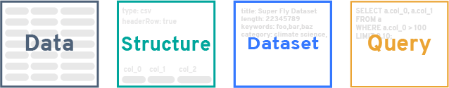

<h1 align="center">Deterministic Querying for the Distributed Web</h1>

<p align="center">
<a href="http://www.brendan.nyc">Brendan O'Brien</a><br>
<a href="http://www.cds.caltech.edu/~mhucka/">Michael Hucka</a>
</p>
<p align="center">
August 2017
</p>
<p align="center">
<b>Abstract</b>
</p>

The current infrastructure that underlies the distribution and processing of data over the Internet has enabled dramatic advances in a wide variety of human activities.  Recent trends promoting open data promise even greater benefits as the number and variety of networked data sets grows.  However, while current technologies and architectures obviously do work, they also show signs of systemic inefficiencies that impede effective large-scale discovery, distribution, preservation and reuse of data sets.  An important source of inefficiencies is rooted in the database-centered pipeline that underlies much of data processing on the Internet today.  The ongoing transition to a content-addressed permanent web offers an opportunity to replace certain software architecture patterns with alternatives that are more efficient and scale more effectively.  We introduce one such new pattern, _deterministic querying_, that combines formalized query definitions, formalized data descriptions, linked metadata, hashing, and a content-addressed file system.  The result supports database-free reuse of data and data processing results---and can do so on the scale of the global Internet.


# Introduction

Open data is a boon to research and progress [@murray2008open; @piwowar2013data; @lowndes2017our; @gewin2016data; @miguel2014promoting].  Though exact numbers are unavailable for the amount of data stored around the world, it is clear it must already be stupendous.  Measured in terms of web pages, the best estimate in mid-2017 puts the number of visible web pages at nearly 50&nbsp;billion [@vandenbosch2016estimating], while in terms of data transmitted over the Internet, global IP traffic reached 1.2&nbsp;zettabytes in 2016 and is predicted to reach 3.3 zettabytes per year by 2021 [@cisco2017zettabyte].  The continuing growth of data being made available on the Internet promises a windfall of benefits in many areas, enabling new discoveries, powering new innovations, lowering costs, and increasing transparency [@martin2017opening; @mckiernan2016open; @madan2017advances; @ferguson2014big; @west2014open; @kansakar2016review].

The open data movement has in part been inspired by and driven by the open _source_ movement, and many of the principles espoused by open data advocates mirror those of open source efforts [@baack2015datafication].  At the heart of both movements is the goal to share the results of people's work.  However, open source has developed methods that are arguably more effective than comparable methods used in open data today.  In particular, developers have effective methods for _accumulating reusable work results in common pools_ so that they can be _directly_ shared, discovered, compared, and reused.  We argue that the comparable operations in open data today are cumbersome and inefficient due to the prevailing system architectures and design patterns in use.

## The open-source advantage

In open source, developers are encouraged to share their work, and to seek out existing solutions to problems [@crowston2008free; @bergquist2001power; @sojer2010code]. As a result, open source software builds upon other software, often by composing larger works out of smaller, reusable elements [@haefliger2008code].  This is possible because software elements---objects, functions, programs, modules---can be reused as static entities incorporated into other works.  The software elements represent intellectual labor: they are answers to questions.  Open-source developers solve new problems in part by seeking out answers to old questions and then using those answers to build their solutions.  This approach works well in software partly because developers have created precise mechanisms to describe the questions, the forms of the answers, and how to store and exchange them.  The questions and answers are defined by specific input and output conventions; storage, versioning, search and sharing is accomplished by revision control systems such as _git_; and composition is achieved by linking source code together into larger works.

In open data, the situation is more diverse and the steps are more inefficient.  The most coherent framework for data reuse is Linked Data [@heath2011linked; @auer2014linked].  This involves databases serving content on the Internet in RDF format [e.g., @maali2012publishing]; search and discovery is aided by some topical catalogs [e.g., @pesce2015setting].  Consumers can query and reference the content in the databases, often by creating pipelines to access, translate and process the data at the user end [e.g., @klimek2016linkedpipes].  However, Linked Data sources remain a minority today---most data sources are shared using the far simpler approach of exposing a network API that enables users to search and access content stored in databases.  The heterogeneity of the APIs and data formats in these cases complicates reuse of data and pushes complexity to individual users.

Whether using Linked Data or more conventional networked databases, it is important to note that different users often end up recreating the same solutions over and over.  The pattern is that some computing system is built to consume data sets, translate the data, perform operations on the data, and then interpret the results.  Sometimes the results are stored in a _local_ (not shared) database, usually in a different format than the source format; other times, the intermediate data produced by the operations is thrown away because the processed data is either assumed to be of no value to anyone else, or else the cost of storing, managing and sharing intermediate results is assumed to be higher than simply recomputing them on demand.

The consequence is that answers to questions are often not being shared, discovered or reused by other potential users of open data.

## Databases and modern software stacks

<!-- might work in citation to muir et al 2016 for how amount of data affects computation needs -->

Central to the problem of treating open data as reusable components is that there is no commonly-accepted method for using the _output_ of an open data process as the _input_ to another open data process when the processes are not part of a common pipeline.  Methods for reusing computational results in distributed workflows do exist, but they are specific to particular execution environments or frameworks [e.g., @elghandour2012restore].  No common scheme exists for persisting and reusing results of computations produced by widely-used software stacks such as those within today's web applications---the applications that power so many cloud-based services.

The architectural patterns underlying modern software stacks are part of the problem.  One of the greatest barriers to efficient reuse of results is the _positioning of the database_.  In many cases, the database is placed at the heart of a modern web-based application.  Data is stored in the database in a raw form, but then must be encoded into whatever form is consumed by the user at access time.  This approach of _interpreting the data outward_ towards the user makes perfect sense when the primary "view" or representation of this data is in the form of structured HTML:

```
  Database -> HTML Render -> Network -> Web Browser
```

From there, the natural next step is to provide programmatic access to this data via an HTTP API, which is essentially another "view" on the same central database:

```
  Database -> API Encode -> Network -> API Decode
```

This approach is flexible, and there is no question that it works---after all, it serves as the basis of many software systems.  However, this approach is the product of a long history of accumulated technical contexts, some of which are now the source of a great deal of inefficiency.  Consider what happens when the results of a data service are processed by another service:

```
  Database -> API Encode -> Network -> API Decode -> Process -> Database
```

In today's software environments, this pattern uses multiple servers to take data out of one database, serve it across a network, decode it, process it, and put it into another database (which in fact may require additional encoding, if the output of the processing does not match how it is stored in the database---and it often does not).  Further, since the amount of computing needed to process data grows with the amount of data [e.g., @muir2016real] and the amount of data generated by human activity grows continually, the amount of resources expended on this inefficient arrangement continues to increase.  To add insult to injury, every step requires separate engineering and long-term software maintenance.  This pattern heavily favors holding the data as closed information because  "opening" the data is an active effort that would require additional engineering time, CPU cycles, etc.

In other words, not only is this architecture inefficient in its use of network and computational resources: the economics of the arrangement actively discourages sharing outputs.

## Reimagining distributed open data

If it were possible to short-circuit some of the steps in the architectural pattern above, it could be made more efficient, at least for certain use cases.  For example, what if the decoding steps could be removed?  For that matter, what if the databases could be removed too, and the network itself somehow could be the database?  Then the process diagram would look like this:

```
  Network -> Process -> Network
```

The idea that the network itself could be "queried for data" as if it where a database may seem ludicrous at first.  The rest of this white paper describes how this _can_ be achieved, using a combination of technologies and architectural patterns.  Renewed attention to distributed, content-addressed networks with a robust linked-data structure provides the foundation necessary for achieving this.  What follows is a plan for a suite of tools that collectively provide the necessary components to be able to query a network, with the explicit design goal of facilitating the accumulation of results through data that is held on the network.

<!-- need compare this to "network is the database" -->

## Use cases and limitations

The intent is not to eliminate database technologies in all situations. Rather, the goal is to reduce the need for large numbers of users to recreate identical accesses and encode/decode steps on the same data.  Assuming that most data continue to be held in databases, database accesses will still be needed for novel queries; the gains in reduced computation and network accesses will be realized when multiple distributed users or processes repeat the same queries.  The reality today is that queries to content-addressed networks are likely to be slower than queries to local databases, but those losses are expected to be offset by deduplication of data as well as resource use reduction in the aggregate.  This form of deterministic querying deliberately accepts a number of performance tradeoffs for the sake of repeatability and interoperability.

The approach described here will be best suited to certain use cases.  The efficacy of this technique is inversely correlated to how frequently the underlying data changes; data that is not mutated after initial insertion is ideal for this approach.  Thankfully, many data sets fall into this category, including scientific research data, government data, industrial data, and more.  We contend that the development of deterministic querying offers a way to build an open data commons to provide greater opportunity for the collective, accumulative advancement of open data.

# Data, hashes, queries and graphs

_Deterministic querying_ is designed for content-addressed network systems. In content-based addressing, data is stored and retrieved not by its location (as is done in the current Web via HTTP), but rather by a function computed over its content---specifically, a hash function that uniquely identifies the content [@aurora2007code].  This _content address_ can be computed independently by anyone for any content simply by running the hash function; they do not require a centralized authority to coordinate the assignment of labels or addresses.  This decentralized approach is the foundation of an emerging, modern, reliable data commons that deterministic querying aims to support.

Content-based addressing, also known as compare-by-hash [@aurora2007code], was first used for networked file systems in the early 2000's [@muthitacharoen2001low; @tolia2003opportunistic], and is a staple of peer-to-peer systems today.  In this work, we specifically target IPFS (the InterPlanetary File System), an open-source, distributed, content-addressed, peer-to-peer, versioned file system and protocol [@benet2014ipfs; @ipfs2017].  IPFS distributes content over a network using a secure distributed hash table [@maymounkov2002kademlia; @freedman2004democratizing; @baumgart2007s].  The basic premise of IPFS and other content-addressed file systems is that identical content will produce identical hash values, and thus be identified uniquely.

A fundamental goal of deterministic querying is to _maximize hash discovery_ in content-addressed networks.  The techniques below are aimed to ensure that equivalent data sets, as well as semantically-equivalent queries for data sets, each resolve to the same hash even if created by different parties in different locations at different times.  This consequently leads naturally to automatic discovery of existing data sets and queries, and deduplication of content on the network.

To maximize hash discovery, the process of describing data sets and queries must be made precise and consistent.  To the greatest extent possible, content and queries that are the same must produce the same hash value; thus, definitions of data resources and queries must follow carefully-defined conventions, and alternative forms must be limited.  We compensate for this rigidity by storing nonessential data separately, then connecting that to data sets and queries using separate mechanisms for linking and discovery.  This leads to the four building blocks of deterministic querying: `Data`, `Dataset`, `Structure`, and `Query`.

<p align="center">

</p>

## `Data` and `Structure`

<!--
This section could be called "schemas" or even "resources"; we avoid these terms because they are overused and may evoke unwanted associations.
-->

In the context of deterministic querying, `Data` has its natural meaning: a collection of raw values of _something_---numerical values, qualitative values, anything---organized in some systematic way.  An example file format for storing data today is the venerable comma-separated values (CSV) format, which consists of rows of numerical or text values separated by commas, with an optional first line containing column headings.  Here is an example:


```
lat,lng,precip,datestamp,title
60.00,-50.049303,349034,2017-02-14,precip measurement one
60.00,-50.049303,430004,2017-02-15,precip measurement two
...
```

A `Data` object in a content-addressed file system will be a static object identified by a hash value (henceforth, to be called simply its _hash_).  Assume that this data file resolves to the following hash on the network:

```
1220cb90f19d806704600e32b152afbad9fdfc91b0216e15585f9fc1044d44c72d5b
```

As discussed above, this hash will be unique: any file whose computed hash matches the one above _will contain the same content_, no matter how or where it was created (assuming we use the same conventions for line endings, spaces and some other details), or where it's physically located in the content-addressed file system.  Queries to this data file will always run against the same set of bytes because the hash is _deterministic_.

Being able to interpret the bytes in a given `Data` object requires additional information outside of the `Data` itself.  This information is needed to provide precise details about how to interpret the content of a `Data` object.  That is the purpose of `Structure`.  It contains fields that indicate such things as the format of a `Data` object, the character encoding, compression settings, and other details.  Here is an example shown in a human-readable JSON format:


```json
{
  "format" : "text/csv",
  "formatConfig" : {
    "delimiter": ",",
    "doubleQuote": true,
    "lineTerminator": "\r\n",
    "quoteChar": "\"",
    "skipInitialSpace": true,
    "header": true
  },
  "encoding" : "utf-8",
  "compression" : "gzip",
  "schema" : {
    "fields" : [
      { "title" : "col_0", "type" : "float", "default" : 0 },
      { "title" : "col_1", "type" : "float", "default" : 0 },
      { "title" : "col_2", "type" : "float", "default" : 0 },
      { "title" : "col_3", "type" : "datestamp", "default" : 0 },
      { "title" : "col_4", "type": "string", "default": "" }
    ]
  },
}
```

The specification of `Structure` is given elsewhere, but as the example illustrates, it contains information that enables software and users to read the content of a `Data` object.  For example, `format` specifies how the data is stored; the field value is a MIME type value (e.g., `"text/csv"` for CSV [@shafranovich2005common]).  The related field `formatConfig` removes as much ambiguity as possible about how to interpret the specified `format` because some formats have a number of dialects, and variants need to be identified exactly.

The field `schema` merits some additional explanation.  Many formats such as CSV do not internally define the data types of values and have no standard way of communicating this information, which forces the requirement to define an approach for externalizing it outside of a `Data` file.  It turns out, however, that describing the format explicitly in a generalized way makes it possible to store and reuse those descriptions independently: they become another object in the content-addressed storage space, hashed and stored like everything else.

In fact, `Structure` is abstracted in such a way that it contains nothing about _meaning_.  If the values of a `Data` file change, the `Structure` can remain the same; if multiple `Data` objects anywhere on an IPFS network all have the same structure, the `Structure` object can remain the same.  _This is true even if the `Data` objects are about entirely different things_.  As will become more clear below, this is part of the fundamental insight that makes deterministic querying possible.

<!--
Finally, it is worth noting that we focus on widely-used formats such as CSV as foundational storage formats for developing deterministic querying, but the extensions to other types of data should be clear.
-->

## `Dataset`

A `Structure` describes the form of a `Data` object.  The two are connected together, along with metadata about the `Data`, in a `Dataset` object.

<p align="center">

</p>

As illustrated above, a `Dataset` references one `Data` and one `Structure` object, and it also adds additional descriptive metadata.  A `Dataset` must resolve to one and only one `Data` entity; this is accomplished by using the unique hashes of the associated `Data` and `Structure` objects.  This separation of concerns achieves two important goals:

1. The same data can be described by different metadata.  For example, a repeated experiment may produce identical data, but it should be described differently if only to indicate different time stamps or conditions.  Separating the description from the values saves storage and bandwidth because only the changes (the metadata) are stored separately.

2. Metadata formats can be changed and updated independently.  In many cases, data remains static after it is gathered.  Software frameworks, however, often change rapidly, and developers and users find needs to change and update metadata about data.  With this separation, metadata can be changed without changing the underlying data.

To retain a trail of changes, `Dataset` contains a field called `previous` that references the hash of another `Dataset` object.  This establishes a clear history of changes to any component of a data set, whether this is the metadata, or the `Data`, or the `Structure`.  For example, when changes are made to metadata without changing the `Data` or its `Structure`, only the `Dataset` object needs to change:

<p align="center">

</p>

Conversely, if the `Data` changes but the `Structure` does not, the new `Dataset` object will also reference the hash of the new `Data` object:

<p align="center">

</p>

Finally, if the `Structure` changes, the `Data` necessarily changes as well:

<p align="center">

</p>

In each case, the `Dataset` identifies the unique `Structure` object that defines the format of the data in the `Data` object(s), and the value of the `previous` has points to any previous `Dataset` definition that may have come before.


## `Query`


## Query execution

<!--

structure/previous

Put this as a final paragraph in this section 

In the spirit of Open Data, it's important to acknowledge and support uses outside of these techniques.  Storing data in common formats reduces friction, allowing data to flow freely between ecosystems.  It is my view that the performance penalties incurred by storing data in common formats are worth paying in favor of interoperability.  Some of these performance penalties can be compensated for through sidecar lookup tables, which represent a future area of research.
-->

# Distributed queries and linked data

<!--
Schemes for linking distributed data sets also exist, particularly in the form of Linked Data [@heath2011linked], but the methods of querying and accessing data currently involve database access and retrieval
-->

# Discussion


<!-- Refs are added automatically by Pandoc after this next section -->
# References
